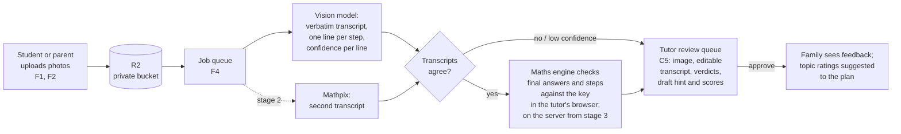
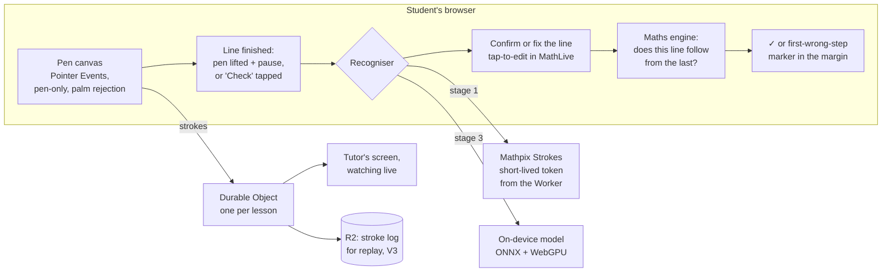

# The future portal: AI, handwriting and live maths

Part 3 of the enhancement roadmap (see [README.md](README.md)). What becomes possible when the
portal can see a student's handwriting, check maths, and use language models — and how to build
each piece so it is safe for children, affordable, and fits Cloudflare.

## Where to start

The ideas below differ widely in how proven they are, and in how much of a child's data they
touch. Ordered by evidence first and risk second:

1. **No AI provider at all.** The readiness forecast (AI-5) and the operations optimiser and
   churn warning (AI-10). These are statistics on data the portal already holds, with no
   consent questions.
2. **AI that helps the tutor, fed only by the tutor.**
   - **AI-12, the pre-lesson brief.** The best evidence of any idea here: the Tutor CoPilot
     trial.
   - **AI-2, dictated lesson notes.** An adult's voice, and Workers AI keeps it inside
     Cloudflare.
   - **AI-3, drafted family digests.** Approved by the tutor.

   None of them sends a child's own work anywhere.
3. **Checking maths, before any language model sees a child's work.**
   - The maths engine in practice sets (L3), with fingerprints. Nothing leaves the portal.
   - Line-by-line checking of a student's ink (AI-7, stage 1). It uses no language model,
     but the handwriting goes to a recognition service, so it needs consent (F7) like
     everything after it.
4. **Children's work with an AI in the loop, behind consent.** Homework evaluation (AI-1),
   misconception suggestions (AI-6), adaptive practice (AI-4). F7 must exist first. Every
   result is reviewed by a tutor until measured accuracy says otherwise.
5. **A child talking to an AI.** The study helper (AI-9) and explained recordings (AI-11).
   Last, piloted with a few consenting families, fully visible to guardians and tutors.

## The features

Each is rated for **maturity**, how proven the underlying technology is:
- **proven** — in wide use in shipping products
- **emerging** — shipping, but accuracy still improving
- **experimental** — research-grade

"Needs" refers to the foundations in [feature-plans.md](feature-plans.md#0-foundations). Every
feature here needs the **F11 AI layer** unless it is marked *no AI provider*. Anything a child
produces also needs **F7 consent**.

| ID | Feature | Maturity | Size | Running cost |
| --- | --- | --- | --- | --- |
| AI-1 | Automated homework evaluation | emerging | XL | cents per homework |
| AI-2 | Lesson-notes assistant (voice to structured notes) | proven | M | within free tiers |
| AI-3 | Family digests and progress narratives | proven | S | within free tiers |
| AI-4 | Adaptive practice and generated problems | emerging | L | low |
| AI-5 | Goal-readiness forecast | proven, *no AI provider* | S | $0 |
| AI-6 | Misconception tagging | emerging | M | low |
| AI-7 | Live handwriting recognition while solving | emerging | XL | $0 on-device, or cents per session |
| AI-8 | "Ask the portal": questions in plain English | emerging | M | low |
| AI-9 | Between-lesson study helper for students | emerging | L | low to moderate |
| AI-10 | Smarter operations: schedule optimiser, churn warning | proven, *no AI provider* | M | $0 |
| AI-11 | Explain-your-thinking recordings | emerging | L | low |
| AI-12 | Pre-lesson brief for the tutor | proven | S | within free tiers |

### AI-1 · Automated homework evaluation

**The idea.** A student photographs finished homework, or writes it on a tablet (AI-7). Within
minutes the tutor sees:
- the work transcribed line by line
- each final answer checked against the key
- the first wrong step in each problem flagged
- a draft score per topic and a draft hint

The tutor approves in seconds instead of marking from scratch. After enough approvals prove it
right, the simplest cases can be released without waiting.

**What the evidence says.**
- **Recent studies.** They agree on two things:
  - Vision models have become good at *reading* handwritten maths, and are now better than
    dedicated maths OCR on messy pages.
  - They are still not reliable *judges*.

  | Study | Finding |
  | --- | --- |
  | EDU-CIRCUIT-HW (Feb 2026, 1,300 university STEM solutions) | The best model misread at least one line in 38% of solutions, the weakest in 81%. Grading agreement with official scores was 74.5% for the best model against 81.3% for teaching assistants. Sending only the ~3% least-confident items to a human brought agreement to human level. |
  | UC Irvine calculus study (Mar 2026, ~800 students) | AI scores were within a point of the TA's in 68–86% of cases. In under 2% of cases the model silently *corrected* a student's mistake while transcribing it. |
  | FERMAT (ACL 2025, grades 7–12) | Models found errors less well in handwriting than in the same work typed. That argues for reading first and reasoning separately. |
  | Mathpix vs a vision model (UCI, 171 hard handwritten solutions) | Mathpix transcripts were acceptable 55% of the time; a small GPT-4.1 model 84%. |

- **What they point to.** The research points to the same shape: **transcribe, then verify
  symbolically, then let a person decide on anything uncertain.**
- **How shipping products do it.**
  - **Gradescope.** It lays each page over the blank template and groups matching answers
    for one-click grading.
  - **Khanmigo.** It computes with a calculator rather than trusting the model's own arithmetic.

**The design.**

1. **The key comes first.** When setting homework (L1), the tutor records the final answer
   to each problem, and optionally a worked solution. Without a key, the pipeline can
   transcribe and draft a hint but cannot mark.
2. **Transcribe literally.** A vision model is asked for a verbatim transcript of each problem,
   with these rules:
   - one line per written step, in LaTeX
   - crossed-out work marked
   - a confidence for each line
   - **no correction of the student's errors**, which is the silent-fix failure above

   The image is cropped to the work, with no name and no worksheet header (AG2).
3. **Check symbolically.** The maths engine compares each final answer with the key, and each
   line with the one before (see [Checking the maths](#checking-the-maths)). The engine
   decides right and wrong; the language model never does.
   - **Stages 1–2.** The engine runs in the tutor's browser as the review opens, so the free
     plan's CPU limit does not apply, and fixing a misread line re-checks it at once.
   - **Stage 3.** Releasing results without a tutor means checking on the server, and that is
     the point at which the $5 plan becomes necessary (see
     [Running it on Cloudflare](#running-it-on-cloudflare)).
4. **Draft feedback.** A language model is given the problem, the key, the worked solution,
   the transcript and the engine's verdicts. It drafts a hint in the tutor's style that points
   at the first wrong step without giving the answer, and it suggests rubric lines and topic
   scores.
5. **The tutor decides.** Everything lands in the review queue (C5) as a draft. The tutor fixes
   the transcript if it was misread (the verdicts recompute), edits the hint, and approves.
   Only approved feedback reaches the student and family (AG4). It is audited without its
   content (AG7).
6. **Delete what's no longer needed.**
   - **Providers.** They keep nothing (AG3).
   - **The portal's own copy.** The photo follows the retention schedule (A3), e.g. 12 months,
     so the family and the next tutor can look back at the work. The family can delete it
     sooner.
   - **The text.** The approved transcript and verdicts stay, as text.

**Staged path.**

| Stage | Adds | Before moving on |
| --- | --- | --- |
| 0. Prerequisites | Consent for AI processing (F7). A way for students or parents to upload (F1, F2). Homework with answer keys (L1). The review queue (C5). Vendor agreements. A retention policy. | A lawyer's read of the consent wording. |
| 1. Answers only | Transcription, final-answer checking, tutor review of everything. | 100–200 tutor-approved pages as a test set. Measure how often the transcript needed fixing. |
| 2. Steps and hints | Line-by-line checking, first-wrong-step, drafted hints, rubric suggestions, a second transcriber whose disagreements go to the tutor, misconception suggestions (AI-6). | Per-tutor edit rates below an agreed level for a term. |
| 3. Selective auto-release | Results that are high-confidence, have transcripts that agree, and are verified by the engine are released at once; everything else still waits. Tablet ink instead of photos (AI-7). | Stays opt-in per tutor and per homework type. |

**Choosing the model.** Candidates, subject to a 50-page head-to-head on the institute's own
homework, which is the only benchmark that matters:
- **Anthropic's Claude.** Its terms allow serving minors with safeguards (age checks,
  moderation, COPPA compliance, disclosure that it is AI). Data is deleted within 30 days and
  images are not used for training.
- **Cloudflare Workers AI vision models (Llama 4 Scout, Gemma 3).** They stay inside
  Cloudflare, and Cloudflare does not train on the data. No one has benchmarked them on
  handwritten maths, which is exactly what the head-to-head would find out.
- **Mathpix.** It is the second transcriber, with retention turned off on the key
  (`improve_mathpix: false`).
- **OpenAI.** Only after zero data retention is approved by OpenAI, which its own guidance
  requires before any data about under-13s is sent.
- **Not Gemini's API.** Its terms exclude services likely to be used by under-18s.

**Cost.** Estimates at current list prices: about $0.002 an image with Mathpix, and about a cent
a page for a frontier model's transcription. Budget **$20–50 a month at 1,000 pages** including
the feedback drafting. Workers AI models would cost a fraction of that if the head-to-head
shows they are good enough.

**Data.**
- `homework_submissions`: homework, files, submitted_by, submitted_at.
- `ai_evaluations`: submission, stage, status (`draft`, `approved`, `rejected`), transcript
  JSON, verdicts JSON, confidence, model, cost_cents, created_at.
- `ai_evaluation_reviews`: evaluation, reviewer, what was edited, released_at.

**Needs.** F1, F2, F4, F7, F11, L1, C5. **Maturity.** Emerging. **Size.** XL, of which stage 1 is
an L.

### AI-7 · Live handwriting recognition while solving

**The idea.** A student solves a problem on a tablet or a touchscreen laptop, in their own
handwriting, one step per line. As each line is finished the portal recognises it and checks
that it follows from the line before. It marks the first step that does not, like Mathspace
does, and like Apple's Math Notes does for calculations. The tutor can watch live from their
own screen, in the room or online.

**The design.**

**How each part works.**
- **Capture.**
  - **Pointer Events.** They say whether a touch is a pen or a finger, and give pressure and
    tilt. `getCoalescedEvents()` (in Safari since iOS 18.2) catches every sample of an Apple
    Pencil's ~240 Hz.
  - **The canvas.** It sets `touch-action: none`, suppresses iPad's Scribble, and ignores
    touches while the pen is down, which gives palm rejection.
  - **Drawing.** Strokes are drawn at once with perfect-freehand (MIT), stored as points,
    times and pressure (the format Mathpix accepts), and exportable to InkML.
  - **Not tldraw.** tldraw needs a paid licence to use without its watermark.
- **When to recognise.** Guide lines on the canvas ask for one step per line. A line is
  recognised when the pen lifts and pauses for about 0.7 seconds, or when the student taps
  **Check**. The tutor sets whether checking is live or on request, because instant marking
  can become a crutch.
- **Recognition, in stages.**
  1. **Mathpix Strokes.** It is built for this: strokes in, LaTeX out, updating as the student
     writes. The Worker issues a short-lived token, so the browser calls Mathpix directly and
     the API key never leaves the Worker.
  2. The recognised line is shown back in typeset form, and the student can **tap to fix a
     misread symbol** in a MathLive field. A recognition error is then never mistaken for a
     maths error.
  3. **Later, on the device.** Recognition on the device, with a small open model running in
     the browser through ONNX Runtime Web and WebGPU. WebGPU is in Safari 26 on iPadOS 26.
     `pix2text-mfr` (MIT licence, available as ONNX) is the candidate; the cloud is the
     fallback when confidence is low. This is free per use and keeps the ink on the device.
     Open models are benchmarked on single expressions, so accuracy on children's multi-line
     work is unknown until tried.
- **Checking.** The maths engine runs in the browser (see [Checking the maths](#checking-the-maths)).
  No language model is involved in the first stages. A hint is available on request later:
  the typeset lines are sent as text, never the ink.
- **Watching live.** One Cloudflare Durable Object per lesson relays the strokes to the
  tutor's screen over WebSockets and saves the board.
  - **One writer.** The student is the only writer. A simple relay is enough, with no
    shared-editing library (Yjs) until tutors annotate too.
  - **Free-plan capacity.** It fits the free plan. The binding limit is the Durable Objects
    time allowance, 13,000 GB-seconds a day: about 28 hours of live board a day, since an
    active board cannot hibernate between strokes. That is well above the institute's
    lessons a day.

**Staged path.**

| Stage | Adds |
| --- | --- |
| 1 | The pen canvas, a **Check** button, cloud recognition, confirm-the-line, first-wrong-step marking. No language model. |
| 2 | Automatic recognition on pause, tap-to-fix, the tutor's live view, hints on request (text only), saving for replay (V3). |
| 3 | On-device recognition with cloud fallback; SymPy for inequalities and harder algebra; per-topic analytics feeding progress; ink as a homework submission (AI-1 stage 3). |

**Cost.** About **$16 a month at 8,000 lines** if charged per recognition request, or about $70 if
each line opens its own Mathpix session. Keeping one session per problem lowers that. MyScript's
web SDK (cloud, billed per session) is worth a short trial as an alternative. On-device
recognition is $0 per use.

**Unknowns to measure first.** No vendor publishes latency. The target is under a second
from pause to mark, and it has to be measured on the iPads students actually use.

**Needs.**
- **F1.** The student must be signed in.
- **F7.** The ink leaves the device in stages 1–2.
- **F11.** Its consent check and provider allowlist govern the recognition service.
- **V2.** The canvas is the whiteboard's.
- **F2.** For replay. **Maturity.** Emerging. **Size.** XL, of which
stage 1 is an L.

### AI-2 · Lesson-notes assistant

**Why.** A tutor finishing a lesson has two minutes to write notes. Good notes feed the
progress chart, the report (L5) and the digest (M3). Short notes starve them.

This is the fastest-moving area in the industry:
- **TutorCruncher.** It launched AI lesson plans and post-lesson reports ("Bobbin") in
  September 2026.
- **Wise, Lessonspace and Pencil Spaces.** Each writes AI summaries of lessons.

Most of them summarise a *recording of the lesson*, which means recording a child. Dictation
by the tutor gets the same notes from an adult's voice instead.

**How it works.**
1. At the end of a lesson the tutor taps the microphone in the lesson cockpit (L6) and talks
   for 30–60 seconds: "Worked on comparing fractions, she's got like denominators, still
   guessing with unlike ones. Homework 4C pages 12 to 15. Next time, number lines."
2. The audio is transcribed by Whisper on Cloudflare Workers AI. It runs inside Cloudflare, so
   no audio leaves for a third party.
3. A language model turns the transcript into the structured note (L7):
   - covered
   - went well
   - to work on
   - homework
   - next time
4. It also proposes topic ratings for the plan topics mentioned ("BA4.08 Fractions → 3"),
   drawn only from the student's plan topics.
5. Everything lands in the lesson form as a draft. The tutor edits and saves; nothing is saved
   unreviewed (AG4).

**Why it is safe.**
- The audio is the tutor's voice, not the child's.
- Names are replaced before the language model sees the text (AG2).
- The transcript is discarded once the note is saved.
- Audit: "notes drafted by voice for Sofia's lesson", without the words.

**Cost.** Whisper and a small model on Workers AI fit inside the free daily allowance at this
institute's scale, a few dozen lessons a day. See
[the Cloudflare notes](#running-it-on-cloudflare).

**Needs.** F11, L7; L6 makes it natural. **Maturity.** Proven: dictation with LLM clean-up is a
standard pattern.

### AI-3 · Family digests and progress narratives

**Why.** The weekly digest (M3) and the term report (L5) need a paragraph a parent will read:
"Sofia moved from guessing to reasoning about unlike fractions this week; next up is number
lines." Tutors rarely have time to write one.

**The evidence.** In a randomised trial with Eedi (165 students), tutors sent 76% of Google's
LearnLM drafts with little or no editing, and students solved more new problems (66% against
61%). That AI had 20 weeks of each student's data, which is about what the portal holds per
student.

**How it works.** A language model is given only structured, money-free facts:
- the lessons' structured notes
- topic score changes
- homework completion
- the plan's pace status

It drafts two or three sentences in the institute's voice. The tutor approves the draft before
it goes out; after a term of approvals with few edits, the office may switch that tutor's
digests to automatic (AG4).

**Guard rails.**
- **Scoped inputs.** They come from the same scoped functions as the parent's dashboard (AG5),
  so the paragraph cannot contain anything the parent's screen would not.
- **No money.** No money, ever (AG6).
- **No invented facts.** The prompt forbids new facts: every claim must come from the input.
  A check rejects a draft that names a topic not in the input.

**Needs.** M3 or L5, F11. **Maturity.** Proven.

### AI-4 · Adaptive practice and generated problems

**Why.** Practice sets (L3) need many good items per topic, far more than tutors can write. The
leading platforms keep students at the edge of their ability, choosing the next problem by
how the student is doing:
- **Alcumus.** It models the student and each problem on one scale and updates both after
  every answer.
- **IXL's SmartScore.** It penalises misses more heavily near mastery.
- **Math Academy.** It works from a knowledge graph.

Interleaving topics had an effect size of 0.83 in a 54-class trial. In August 2026 Khan Academy
began offering AI-drafted questions that teachers review before assigning, which is the same
review-before-use pattern.

**How it works.**
- **Choosing the next item.** A small knowledge-tracing model per student and topic. Bayesian
  Knowledge Tracing is well understood and cheap: four parameters per topic, updated per
  attempt, computed in the Worker. It estimates mastery, and practice picks the item that
  best moves an unmastered topic.
- **Making more items.** A language model drafts variants of a tutor-written item. Every
  generated item is checked by the maths engine before it can be used:
  - the stated answer must satisfy the problem
  - two independent solution paths must agree
  - the wording must be self-contained

  Items that fail are discarded. Survivors wait for a tutor's approval.
- **Where the checking runs.** On the free plan, generated drafts are checked by the maths
  engine in the tutor's browser as they open the drafts for review; failures are discarded
  there. Generating and checking items in bulk ahead of review runs on the server, which
  needs the $5 plan (see [Checking the maths](#checking-the-maths)).
- **Where the results go.** Mastery estimates *suggest* topic ratings. The 1–5 ratings
  stay tutor-owned (Phase 16).

**Copyright.** Generated items are original, and must not paraphrase AoPS or Beast Academy
problems; AoPS's terms bar commercial reproduction of any part of its services.
- **What the generator is given.** The topic, the institute's own items, and CC BY material,
  never book text. OpenStax Prealgebra 2e and Illustrative Mathematics 6–8 are CC BY 4.0,
  credited where adapted.
- **AMC problems.** They need the MAA's written permission for paid use.

**Needs.** L3, F11. **Maturity.** Knowledge tracing is proven; generated maths items are
emerging, which is why each is verified and reviewed.

### AI-5 · Goal-readiness forecast (no AI provider)

**Why.** The progress page says "behind" or "on track" against a straight pace line
(`computeProgress`: within 10 points of the line is on track). A parent really wants to know:
*at this rate, will she be ready by June?* Other products answer that question:
- **Math Academy.** Its diagnostic report projects completion dates for several levels of
  daily effort.
- **Khan Academy.** Its Mastery Goals carry due dates.

**How it works.**
- **The fit.** Fit the mastery timeline, which is already computed per plan, with a simple
  model: a linear trend on the last six weeks, with an uncertainty band from week-to-week
  variation.
- **The answer.** Project the date the plan reaches 100%, e.g. "At the current pace, ready by
  mid-July. Two more lessons a month would bring that to June."
- **Where it's computed.** In `packages/shared` beside `computeProgress`, so the chart, the
  report and the digest agree.

**Guard rails.** Shown as a range, never a promise, with too little data saying so ("forecast
after five scored lessons").

**Needs.** None. **Maturity.** Proven. **Cost.** $0.

### AI-6 · Misconception tagging

**Why.** "Needs help with fractions" is less useful than *why*. For example, adding numerators
and denominators, or treating a fraction's size as depending on the denominator alone. Naming
the error pattern is what lets the next lesson fix it:
- **Eedi.** It maps each wrong answer to a named misconception, and its dataset underpinned a
  public Kaggle challenge on exactly this.
- **Snorkl.** Its teacher view groups students by common misconception.

**How it works.**
- **A shared list of error patterns.** A curated library, about 10 per curriculum level to
  start, written by the institute's tutors.
- **Tagging by hand.** Tutors tag a misconception when scoring a topic (one tap in L6).
- **Suggestions.** Checked practice (L3) and homework evaluation (AI-1) can *suggest* a tag
  when a wrong answer matches a known pattern (e.g. 1/2 + 1/3 answered as 2/5).
- **Where it shows.** Tags appear on the progress page and in the heatmap (L9).

**Data.** `misconceptions` (topic, name, description, example); `misconception_observations`
(student, misconception, source, session or attempt, at, resolved_at).

**Needs.** L3 or AI-1 for automatic suggestions. By hand, it needs nothing. **Maturity.**
Emerging for automatic detection; by hand it is simple.

### AI-8 · "Ask the portal"

**Why.** The office asks questions no screen answers:
- "How many hours did Alex teach in August?"
- "Which BA4 students are behind?"
- "Who hasn't paid since July?"

Canvas and business tools answer with report builders. A question box is faster.

**How it works.**
- **Tool use, not SQL.** The language model is given a fixed set of *tools*, each one an
  existing scoped repository function: `listSessions`, `computeBalances`,
  `listProgressOverview`, and so on. It answers by calling them as the person asking.
- **Why tools.** A tool can only return what that person's screens would. A model writing
  SQL could return anything.
- **Answers are cited.** "Alex taught 42.5 hours in August", with links to the underlying
  lists.

**Guard rails.**
- **Exposure rules.** Reading only as the person asking (AG5) is the whole design, and the
  exposure crawl gains a test that asks
  leading questions as each persona ("what does Sofia's family pay?" asked as her tutor must
  come back empty).
- **Rollout.** Admin-only for the first version.

**Needs.** F11. **Maturity.** Emerging. **Cost.** Low: a few cents a day of model use.

### AI-9 · A study helper between lessons

**Why.**
- **What exists.** AI tutors are now common:
  - Khanmigo.
  - Mathspace's MiloAI, which flags risky chats to teachers.
  - ChatGPT's study mode and Claude's learning mode.
  - Google's Guided Learning, built on LearnLM.
  - Varsity Tutors, which added AI help between sessions in 2025–26.
- **What they get wrong.** They do not know what this student's tutor is working on, and a
  general assistant will happily give answers away.
- **What this portal can do.** It can bound a helper to the student's own plan topics and this
  week's homework, and show everything to the tutor.

**How it works.**
- **Scope.** A chat available to a student (F1) only while they have homework or practice
  open. It is primed with:
  - the problem
  - the topic
  - the tutor's hint style

  It is instructed to ask questions and give hints, never final answers.
- **Visibility.** Every conversation is visible to the tutor and the guardians, the same rule as
  messaging (M1). Khanmigo lets adults read students' chat transcripts for the same reason.
- **Limits.** A daily limit on usage.
- **Consent.** It is off unless the family opts in (F7).

**Guard rails.**
- **Children and chatbots.** A child talking to an AI is the highest-risk feature here.
  - It needs consent.
  - Transcripts are visible to the guardians.
  - Content filtering, and a hard block on personal-information requests.
  - An escalation path: a "tell my tutor" button that becomes a message (M1).
- **A pilot first.** Pilot it with a few families before any wider use.

**Needs.** F1, F7, F11, L1 or L3, M1. **Maturity.** Emerging. **Cost.** Low to moderate per
active student.

### AI-10 · Smarter operations (no AI provider)

- **Schedule optimiser.** Given each person's available hours (`availability_slots`), rooms
  (S8) and standing lessons, it proposes a week that fits every student with the fewest
  tutor gaps. It is a small constraint problem, solved in the browser. It extends S3.
- **Churn warning.** It scores each family weekly on signals already in the database:
  - weeks since the last lesson
  - recent cancellations (S1)
  - a plan behind pace
  - no guardian sign-in in 30 days

  The top of the list shows on the at-risk panel (G6), which is on the Tutoring tab and so
  carries no money. A growing balance is a signal too, but only in a separate Finance-tab
  version of the list. A transparent points score comes first, and a fitted model only once
  there is a year of history to fit it to.

**Needs.** S3 or G6. **Maturity.** Proven. **Cost.** $0.

### AI-11 · Explain-your-thinking recordings

**Why.** Snorkl's insight is that asking a student to *explain* a solution aloud while they
write shows understanding better than the answer does. It also gives feedback on the
reasoning, not just the result. Snorkl states that it complies with COPPA and FERPA and does
not train on student data. Any provider used here must say the same (AG3).

**How it works.**
- **Recording.** On a practice or homework problem, the student records a short explanation:
  ink from AI-7 plus voice, captured as strokes and audio, not video.
- **Reading it back.** The recording is transcribed (Whisper). A language model compares the
  explanation with the expected reasoning and drafts feedback for the tutor: "explains
  common denominators correctly, but doesn't say why the numerators are added".
- **Replay.** The tutor replays the strokes with the audio, and approves or edits the feedback.

**Guard rails.**
- **Voice consent.** A child's voice is sensitive personal data under the amended COPPA
  Rule's broader definition. It needs specific consent (F7).
- **Retention.** Audio is deleted after 30 days, per the retention schedule (A3). The
  transcript and the tutor's feedback stay, as text.

**Needs.** AI-7 (ink), F2, F7, F11. **Maturity.** Emerging. **Cost.** Low.

### AI-12 · Pre-lesson brief

**Why.** This is where the evidence for AI in tutoring is strongest.
- **Tutor CoPilot.** In a randomised trial, an assistant suggesting what to say during
  lessons raised student mastery by 4 percentage points, and by 9 points for the less
  experienced tutors.
- **The limit.** Stanford's summary of the field finds the evidence gets thinner as the human
  is taken out.

A brief *before* the lesson is the lowest-risk way to get that effect. The tutor stays fully in
charge, and no child talks to a model.

**How it works.** When a tutor opens a lesson in the cockpit (L6), they see a half-page brief:
- what happened last time: the structured note (L7)
- homework to check (L1)
- stalled topics (L14) and topics due for review (L8)
- misconceptions still open (AI-6)
- two or three suggested guiding questions for the next topic

The brief is built entirely from the portal's own data for that student. A language model
writes only the connecting sentences and the questions; the facts are listed, not generated.

**Guard rails.**
- **Who sees it.**
  - **The tutor only.** It never reaches a family.
  - **Not the student either.** The student sits beside the tutor during the lesson (the
    Phase 19 concern), so the brief is read on the tutor's own screen before the lesson, and
    in the cockpit it opens collapsed behind a "Tutor only" toggle (L6).
- **Consent.** Built from structured fields with names replaced (AG2). The prompt carries no
  image, voice or child-authored text, which makes it the easiest AI feature to clear under
  consent.
- **No money** (AG6).

**Needs.** F11, L6, L7; better with L1, L8, L14, AI-6. **Maturity.** Proven pattern. **Cost.** Within
the Workers AI free allowance: one short generation per lesson. **Size.** S.

---

## Checking the maths

Every feature that marks maths (L3, L4, AI-1, AI-7) depends on one question: *is this
expression, or this step, mathematically right?* A computer algebra system answers it,
never a language model.

**The tools.**

| Tool | Fit |
| --- | --- |
| **CortexJS Compute Engine**, with MathLive | Best fit. It reads LaTeX, and `isIdenticallyEqual()` simplifies both sides and also compares them at random points. By its own description that is "a very strong indication, not a formal proof", which is the right strength for homework. MathLive is the matching editable maths field, used for tap-to-fix and for typed answers. |
| **math-expressions** (Doenet) | Built for grading student input; compares by random values. A reasonable alternative. |
| **SymPy in Pyodide** | A full computer algebra system that handles inequalities and domains, running in the browser in a Web Worker. It is a download of several MB, so load it only when needed. Python Workers can run it on the server, but only practically on the paid plan. |
| mathjs, nerdamer, Algebrite | Too limited for step checking. |

**Where it runs.** The free plan's 10 ms of CPU per request rules out running a maths engine in
the Worker. So the engine runs in a browser, and the Worker at most compares numbers:

| Where | Used for | Why it is safe |
| --- | --- | --- |
| The tutor's browser | Reviewing homework (AI-1 stages 1–2): the engine re-checks as the tutor fixes a transcript | The tutor may see the answer key |
| The student's browser | Live step checking (AI-7), where each line is compared with the line before | Comparing a student's own consecutive lines reveals no answer key |
| The Worker, by fingerprint | Practice and diagnostics (L3, L4), where the answer must stay secret | Only numbers are compared on the server: see below |

**Fingerprints: marking without revealing the answer.**
1. When a tutor saves an item, their browser evaluates the correct answer at, say, eight random
   points (avoiding points where it is undefined).
2. The server stores those values as the item's fingerprint. They never go to a student.
3. For each attempt, the student's browser evaluates the *student's* expression at the same
   points and posts the values.
4. The Worker compares the two lists of numbers within a tolerance. That costs microseconds,
   well inside the free CPU budget.
5. The points are not secret; the correct values are.

**Rules for a step.** These are a synthesis of practice, not a published standard:
- **Expression to expression.** Their difference simplifies to zero. If that is
  inconclusive, compare them at random points.
- **Equation to equation.**
  - The two have the same solutions, or one is a non-zero multiple of the other.
  - Squaring both sides or multiplying by a variable is marked *valid, but check for gained or
    lost solutions*, not wrong.
- **Inequalities.** Compare solution sets. This catches the sign that should have flipped,
  and needs SymPy.
- **The first wrong step.** It is the first line not equivalent to the line before it. Each
  line is also compared with the original problem, so a student who recovers is not flagged
  again at every later line.
- **Geometry proofs and word explanations.** These are beyond an algebra engine: a language
  model drafts, the tutor decides.

---

## Running it on Cloudflare

Figures are from Cloudflare's documentation on 24 September 2026. **Free** means the Workers Free
plan; **Paid** is Workers Paid, $5 a month with generous included usage. On the free plan a
daily limit makes calls fail until 00:00 UTC; on Paid the overage is billed instead.

| Product | Free plan | What it is used for here |
| --- | --- | --- |
| Workers | 100,000 requests a day, 10 ms CPU per request | Everything; the CPU limit is why maths checking runs in browsers |
| D1 | 5 GB in total but **500 MB per database**; 5 M rows read and 100,000 written a day; 7-day point-in-time restore | The portal's database; photos must never go here |
| R2 | 10 GB, 1 M writes and 10 M reads a month, no egress fees (a card on file is required) | Photos, stroke logs, backups (F2, F10, V3) |
| Durable Objects | On the free plan (SQLite-backed): 100,000 requests and 13,000 GB-seconds a day; WebSocket messages count 20 to one | The live whiteboard and watching live (V2, AI-7) |
| Queues | 10,000 operations a day, messages kept 24 hours | Background jobs (F4) |
| Workflows | 3,000 steps a day | Multi-step jobs such as AI-1's pipeline |
| Workers AI | 10,000 "neurons" a day, then $0.011 per 1,000 | Speech-to-text, summaries, vision (see below) |
| AI Gateway | Caching, rate limits and analytics are free | The F11 layer. Its logs contain prompts, so logging of child data stays off |
| Vectorize | About 4,900 vectors of 1,024 dimensions stored free | Searching notes and resources, if ever needed |
| Browser Run (formerly Browser Rendering) | 10 browser-minutes a day | PDFs made on the server, if reports and statements are ever emailed as attachments rather than links (L5, B2) |
| Realtime SFU and TURN | 1,000 GB of egress a month, then $0.05/GB | Video lessons (V1) |
| RealtimeKit | No free allowance published; $0.002 per participant-minute | A ready-made meeting UI with recording (V1 alternative) |
| Email Sending | **Paid only**, in beta: 3,000 a month included | Not used: Phase 20 chose an outside provider so email stays free |
| Turnstile | Free | Public forms (G1, F12) |
| Containers | **Paid only** | Not needed |

**Workers AI models that fit, with what the free daily allowance buys.**
- **Speech-to-text.** `whisper-large-v3-turbo` costs $0.0005 an audio-minute, so about 214
  minutes a day are free. That covers dictated notes (AI-2) many times over. The Deepgram
  partner model is ten times the price, and its data handling is not stated, so avoid it for
  children.
- **Summaries and drafting.** `gpt-oss-120b` handles about 28 long drafts a day free. Short
  briefs (AI-12) and digest paragraphs (AI-3) are far smaller.
- **Vision.** Llama 4 Scout, Gemma 3 and Mistral Small 3.1 all read images. None has been
  tested on handwritten maths, which the AI-1 head-to-head must settle. There is no dedicated
  OCR model.
- **Cloudflare's terms.** Cloudflare states that customer content is not used to train models.
  Since July 2026 some large models, and new frontier models at launch, are paid-plan only.

**When the $5 plan becomes worth it.** The first time a chosen feature needs one of these:
- CPU beyond 10 ms per request (a server-side maths engine, image processing)
- Cloudflare's own email
- a paid-only AI model
- a database over 500 MB
- more than the free daily caps

The last matters most for a live business, because on the free plan a busy day stops the
portal until midnight UTC rather than costing a few cents. **The recommendation: move to Workers Paid the first time a chosen feature needs it, and in any
case before the first AI or student-facing feature ships, whichever comes first.**

---

## AI governance

These rules apply to every feature in this document. They are written so that each can be
enforced in code, in the F11 AI layer ([feature-plans.md](feature-plans.md#f11--ai-platform-layer)),
and checked by a test. They are numbered AG1–AG10 ("AI governance") to keep them apart from
the growth features G1–G6.

| # | Rule | Why | Enforced by |
| --- | --- | --- | --- |
| AG1 | **Nothing a child produced is sent to an AI or recognition service without that purpose's parental consent.** That covers photos, handwriting, voice and typed answers. Records the *tutor* wrote about a child are different: they can be processed by an allowlisted provider acting on the institute's behalf, with names removed (AG2), and the privacy notice says so. | COPPA governs data collected online *from* a child. A vendor that keeps or trains on it makes it a disclosure needing separate consent. | `ai.run` refuses child-produced input without an `ai_processing` consent row (F7); an e2e test proves the refusal. |
| AG2 | **Send the least.** Names, emails and phone numbers are replaced with tokens before a prompt leaves the Worker, and put back only in the reply. Images are cropped to the work. | A prompt log at a provider is a copy of a child's record. | The redaction step in `ai.run`; a unit test with a known name. |
| AG3 | **Only providers whose terms allow children's data, and that neither train on it nor keep it longer than needed.** See the provider table in [Compliance notes](#compliance-notes). | A vendor that trains on or keeps a child's data is a third-party disclosure under COPPA, needing separate consent; some vendors' terms forbid this use outright. | A provider allowlist in code; each vendor's terms and settings recorded in `docs/`. |
| AG4 | **A tutor sees it before a family does.** In every first version, AI output is a *draft* a tutor accepts, edits or discards. Automatic release is a later, per-feature setting, and only above a measured accuracy. | Wrong feedback to a child is worse than slow feedback. | Draft tables with `accepted_by`; the family's read routes return only accepted rows. |
| AG5 | **AI answers obey the exposure rules.** An assistant that reads portal data reads it through the same scoped repositories as the screens, as the person asking. | A chat box is a read endpoint, and must not become a way round R1–R9. | The assistant's tools call the scoped repositories; `exposure.spec.ts` asks it leading questions. |
| AG6 | **No money in anything a student or a Tutoring view can reach.** | The Phase 19 rule, applied to generated text. | Prompts for student-facing tasks are built from money-free fields only. |
| AG7 | **Log what was done, never what was said.** Audit events record "AI feedback drafted for Sofia's homework", never the text, the image or the prompt. | The audit log is read by admins; a child's work is not the log's business. | `recordAudit` calls in `ai.run`; the existing "no comment text in the log" rule extended. |
| AG8 | **Every AI feature has an off switch.** Per feature, in institute settings (F9), and per family through consent. | Providers change terms; families change their minds. | A settings check at the top of each AI route. |
| AG9 | **Cost caps.** A daily and monthly spend cap per feature; beyond it, work queues rather than failing silently. | A runaway loop should cost dollars, not hundreds. | AI Gateway rate limits plus a counter in D1. |
| AG10 | **The SSN guard applies to prompts and outputs.** | "Never stored anywhere" includes a provider's logs. | `containsSsn` runs on every prompt and every reply. |

---

## Compliance notes

These notes are **not legal advice**. They summarise what the research found, so each plan
states its obligations; confirm with a lawyer before launching anything that sends children's
data to a third party.

### COPPA in practice

The rule's specifics are in [F7](feature-plans.md#f7--consent-and-privacy-centre). For AI
features specifically:
- **Separate consent.** Sending a child's photo, voice or writing to an outside model is a
  disclosure. Unless the vendor acts purely on the institute's behalf, that needs a
  parent's separate consent. Training on the data is never "integral to the service".
- **The narrow audio exception.** It covers only a child's voice used in place of typing and
  deleted at once. It does not cover recorded explanations (AI-11) or lessons (V1).
- **Biometrics.** Voiceprints and faceprints are now personal information. Never use face or
  voice recognition.
- **Deleting what is no longer needed.** Outside providers keep nothing (AG3). The portal's
  own copies of photos and recordings follow one retention schedule (A3): for example,
  homework photos 12 months and explanation recordings 30 days, with dictated audio deleted
  as soon as it is transcribed.
- **Tutors instead of children.** A tutor dictating notes is an adult's voice (AI-2). Prefer
  designs like this over recording children.

### Providers and their terms

| Provider | Children's data | Retention and training | Use here |
| --- | --- | --- | --- |
| **Cloudflare Workers AI** (Cloudflare's own models) | Processes on the institute's behalf | Customer content not used for training | First choice for speech-to-text and text; vision models untested on handwriting |
| **Anthropic (Claude)** | Allowed for services used by minors, with safeguards: age checks, moderation, COPPA compliance, disclosure that it is AI | Deleted within 30 days; images not used for training | A candidate for AI-1 transcription and drafting |
| **OpenAI** | No personal data about under-13s unless zero data retention is approved first | Kept 30 days by default | Only after zero retention is approved |
| **Google Gemini API** | **Terms exclude services likely to be used by under-18s** | — | Not usable here |
| **Mathpix** | No specific children's terms | Retention can be switched off per key (`improve_mathpix: false`); SOC 2 | Second transcriber (AI-1), stroke recognition (AI-7) |
| **MyScript** | Data processing agreement available | GDPR terms | Alternative for AI-7; trial first |
| Workers AI partner models (e.g. Deepgram) | Data handling not stated | — | Avoid for children |

### Other obligations the plans rely on

| Topic | What applies | Plans affected |
| --- | --- | --- |
| **FERPA** | Applies only to schools that receive US Department of Education funds. A private tutor paid by families is not covered. It matters only if a school contracts the institute as a "school official", which brings use limits and a five-year bar for improper disclosure. | C3 |
| **North Carolina** | No comprehensive privacy law as of September 2026 (bills H462, H301 and S1033 are pending). Four statutes apply: • **G.S. 115C-401.2.** Bans ads and profiling on student data, but only for services used for school purposes at a school's direction. • **Breach notice (G.S. 75-65).** Notify affected people and the Attorney General; over 1,000 people also means the credit bureaus. Encrypted data is exempt unless the key was taken. • **Secure disposal (G.S. 75-64).** • **SSN handling (G.S. 75-62).** The portal's browser-only 1099 already fits it. | F7, F10, A3, C3 |
| **Card payments** | Stripe Checkout or Payment Element keeps the institute at the lightest card-security level (PCI SAQ A). An embedded payment form also needs a strict Content Security Policy; hosted Checkout is simplest. | B1, B3 |
| **Bank payments (ACH)** | Stripe records the debit authorisation. Consumers can dispute for 60 days. Changing the timing of recurring debits needs 7 days' notice. Since June 2026 banking-network rules require fraud monitoring: confirm any change to a tutor's bank details through a second channel, and never store account numbers. | B1, B3, B6 |
| **Text messages** | Business texting needs carrier registration (10DLC) through Twilio or similar, taking 10–15 days. Reminders need prior consent; marketing needs prior *written* consent. Opt-outs sent "by any reasonable means" must be honoured within 10 business days. **Text parents only, never children.** | F3, S2 |
| **Accessibility** | ADA Title III reaches private places of education, and WCAG 2.1/2.2 AA is the benchmark in practice. The 2024 rule for public bodies binds the institute only through a contract with a public school district. | Q1 |
| **Recording lessons** | NC is a one-party-consent state, but a family in an all-party-consent state changes that. Recordings of under-13s are personal information under COPPA. The standard to meet: written parental consent covering purpose, viewers and retention (e.g. 30–90 days), a visible recording indicator, and private storage with audited access. | V1, AI-11 |

---

## Sources

**Handwriting recognition and grading.**
- **Mathpix.**
  - [API pricing](https://mathpix.com/pricing/api)
  - [Privacy](https://mathpix.com/docs/convert/privacy)
  - [Strokes guide](https://docs.mathpix.com/guides/strokes)
- **MyScript.**
  - [iinkTS](https://github.com/MyScript/iinkTS)
  - [data processing agreement](https://www.myscript.com/dpa/)
- **Benchmarks.**
  - [ML Kit digital ink models](https://developers.google.com/ml-kit/vision/digital-ink-recognition/base-models) (no maths)
  - [TAMER, with a benchmark table](https://arxiv.org/html/2408.08578)
  - [Uni-MuMER](https://github.com/BFlameSwift/Uni-MuMER)
  - [MathWriting](https://arxiv.org/html/2404.10690v2)
  - [HME100K](https://arxiv.org/abs/2203.01601)
- **Running a recogniser in the browser.**
  - [pix2text-mfr](https://huggingface.co/breezedeus/pix2text-mfr)
  - [ONNX Runtime Web with WebGPU](https://opensource.microsoft.com/blog/2024/02/29/onnx-runtime-web-unleashes-generative-ai-in-the-browser-using-webgpu/)
  - [Safari 26 WebGPU](https://webkit.org/blog/17333/webkit-features-in-safari-26-0/)
- **Studies of AI grading.**
  - [EDU-CIRCUIT-HW](https://arxiv.org/html/2602.00095)
  - [UC Irvine calculus study](https://arxiv.org/html/2603.00895)
  - [FERMAT](https://aclanthology.org/2025.acl-long.720/)
  - [DrawEduMath](https://arxiv.org/abs/2501.14877)
  - [Kortemeyer](https://arxiv.org/abs/2510.05162)
  - [Pensieve](https://arxiv.org/abs/2507.01431)
- **How products do it.**
  - [Gradescope answer groups](https://guides.gradescope.com/hc/en-us/articles/24838908062093-AI-assisted-grading-and-answer-groups)
  - [Khanmigo maths updates](https://blog.khanacademy.org/khanmigo-math-computation-and-tutoring-updates/)
  - [Snorkl](https://snorkl.app/)

**Maths engines and pen input.**
- [Compute Engine](https://mathlive.io/compute-engine/guides/symbolic-computing/)
- [math-expressions](https://github.com/Doenet/math-expressions)
- [Pyodide packages](https://pyodide.org/en/stable/usage/packages-in-pyodide.html)
- [getCoalescedEvents support](https://caniuse.com/mdn-api_pointerevent_getcoalescedevents)
- [perfect-freehand](https://github.com/steveruizok/perfect-freehand)
- [tldraw licence](https://tldraw.dev/community/license)
- [y-partyserver](https://github.com/cloudflare/partykit/blob/main/packages/y-partyserver/README.md)

**AI in tutoring.**
- **Randomised trials.**
  - [Tutor CoPilot RCT](https://arxiv.org/abs/2410.03017)
  - [LearnLM–Eedi RCT](https://arxiv.org/abs/2512.23633)
  - [Interleaving RCT](https://www.researchgate.net/publication/333154174_A_Randomized_Controlled_Trial_of_Interleaved_Mathematics_Practice)
- **Guidance.**
  - [IES practice guide](https://ies.ed.gov/ncee/wwc/practiceguide/1)
  - [Eedi misconceptions](https://www.kaggle.com/competitions/eedi-mining-misconceptions-in-mathematics)
- **Products.**
  - [Math Academy](https://www.mathacademy.com/how-our-ai-works)
  - [Alcumus](https://artofproblemsolving.com/blog/articles/alcumus-a-peek-under-the-hood-of-our-adaptive-learning-tool)
  - [TutorCruncher Bobbin](https://tutorcruncher.com/blog/introducing-bobbin)
- **Copyright and reusable content.**
  - [AoPS terms](https://artofproblemsolving.com/company/tos)
  - [OpenStax Prealgebra 2e](https://openstax.org/details/books/prealgebra-2e)

**Vendor terms for children's data.**
- [Gemini API terms](https://ai.google.dev/gemini-api/terms)
- [OpenAI under-18 guidance](https://developers.openai.com/api/docs/guides/safety-checks/under-18-api-guidance)
- [Anthropic: organisations serving minors](https://support.claude.com/en/articles/9307344-responsible-use-of-anthropic-s-models-guidelines-for-organizations-serving-minors)
- [Anthropic retention](https://privacy.claude.com/en/articles/7996866-how-long-do-you-store-my-organization-s-data)
- [Workers AI data usage](https://developers.cloudflare.com/workers-ai/platform/data-usage/)

**Cloudflare.**
- [Workers limits](https://developers.cloudflare.com/workers/platform/limits/)
- [D1 limits](https://developers.cloudflare.com/d1/platform/limits/)
- [R2 pricing](https://developers.cloudflare.com/r2/pricing/)
- [Durable Objects pricing](https://developers.cloudflare.com/durable-objects/platform/pricing/)
- [Queues](https://developers.cloudflare.com/queues/platform/pricing/)
- [Workflows](https://developers.cloudflare.com/workflows/reference/pricing/)
- [Workers AI pricing](https://developers.cloudflare.com/workers-ai/platform/pricing/)
- [AI Gateway](https://developers.cloudflare.com/ai-gateway/reference/pricing/)
- [Browser Run](https://developers.cloudflare.com/browser-rendering/platform/pricing/)
- [Email Service](https://developers.cloudflare.com/email-service/platform/pricing/)
- [Realtime SFU](https://developers.cloudflare.com/realtime/sfu/pricing/)
- [RealtimeKit](https://developers.cloudflare.com/realtime/realtimekit/pricing/)

**Law.**
- **Children's privacy (COPPA).**
  - [COPPA final rule](https://www.ftc.gov/legal-library/browse/federal-register-notices/16-cfr-part-312-coppa-final-rule-amendments)
  - [COPPA FAQ](https://www.ftc.gov/business-guidance/resources/complying-coppa-frequently-asked-questions)
- **School records (FERPA).**
  - [34 CFR 99.33](https://www.law.cornell.edu/cfr/text/34/99.33)
- **North Carolina statutes.**
  - [G.S. 115C-401.2](https://www.ncleg.gov/EnactedLegislation/Statutes/HTML/BySection/Chapter_115C/GS_115C-401.2.html)
  - [G.S. 75-65](https://www.ncleg.gov/EnactedLegislation/Statutes/HTML/BySection/Chapter_75/GS_75-65.html)
  - [G.S. 15A-287](https://www.ncleg.gov/EnactedLegislation/Statutes/HTML/BySection/Chapter_15A/GS_15A-287.html)
- **Payments.**
  - [PCI SAQ A update](https://blog.pcisecuritystandards.org/important-updates-announced-for-merchants-validating-to-self-assessment-questionnaire-a)
  - [Stripe ACH](https://docs.stripe.com/payments/ach-direct-debit)
- **Text messages and accessibility.**
  - [Twilio A2P 10DLC](https://www.twilio.com/docs/messaging/compliance/a2p-10dlc)
  - [ADA web guidance](https://www.ada.gov/resources/web-guidance/)
